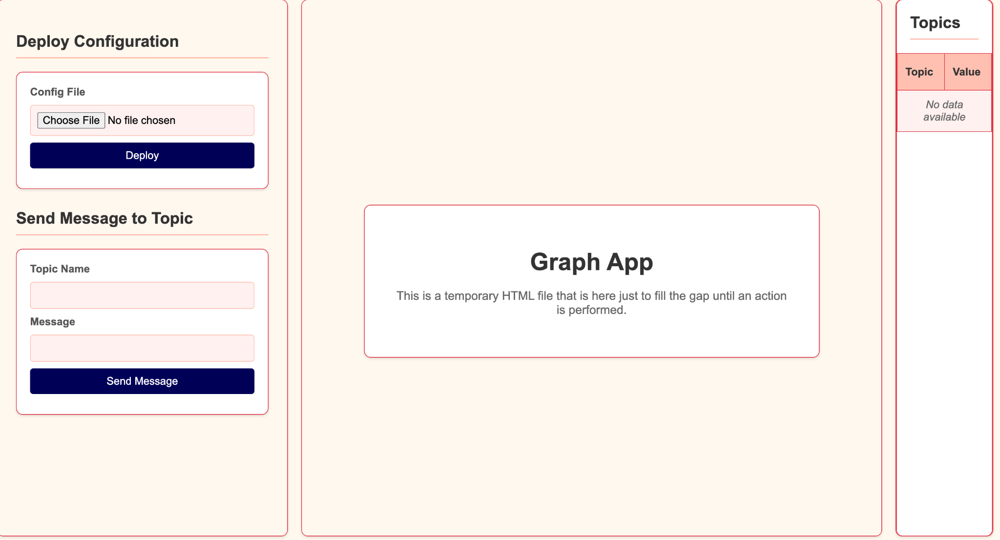

# Java HTTP Server with Agent-Topic Graph Visualization

## Project Overview

This project implements a Java-based HTTP server that allows users to upload configurations for agents and the topics they subscribe to and publish. The server provides a graphical interface that visualizes the relationships between agents and topics, representing them with different shapes. Additionally, the server supports publishing messages to topics, where agents subscribed to those topics can receive the messages, perform calculations, and publish results to their subscribed topics.

## Features

- **Agent-Topic Configuration**: Upload configurations to define agents and the topics they subscribe to and publish.
- **Graph Visualization**: A dynamic graphical UI that displays agents and topics with distinct shapes (e.g., rectangular for topics and circular for agents).
- **Message Publishing and Processing**:
    - Publish messages to specific topics.
    - Agents subscribed to these topics can receive messages, perform calculations, and publish the results.
- **Topic Monitoring**: A UI table displaying topics and the latest messages published to them.

## Getting Started

### Prerequisites

- Java Development Kit (JDK) 8 or higher
- A web browser for accessing the UI
- An IDE such as [Eclipse](https://www.eclipse.org/downloads/) or [IntelliJ IDEA](https://www.jetbrains.com/idea/)

### Installation and Running

1. **Clone the Repository**

   ```bash
   git clone https://github.com/jonathantoaf/advanced_programming.git

2. **Open the Project in an IDE**

   Open the project in your preferred IDE:
- **Eclipse**:
    - Download and install Eclipse from [here](https://www.eclipse.org/downloads/).
    - Open Eclipse and go to `File > Open Projects from File System`.
    - Browse to the `advanced_programming` directory and click `Finish` to import the project.
    - Navigate to the `src` directory and locate the `Main.java` file.
    - Right-click on `Main.java` and select `Run As > Java Application`.

- **IntelliJ IDEA**:
    - Download and install IntelliJ IDEA from [here](https://www.jetbrains.com/idea/).
    - Open IntelliJ IDEA and select `Open` from the welcome screen.
    - Navigate to the `advanced_programming` directory and open it.
    - IntelliJ IDEA will configure the project.
    - Locate the `Main.java` file in the `src` directory.
    - Right-click on `Main.java` and select `Run 'Main'`.


### Configuration

Upload your agent and topic configuration files via the provided API endpoint. Ensure your configuration follows the specified format, detailing each agent and the topics they subscribe to and publish. Below is an example of a configuration file:

**Example Configuration (simple.conf):**

```plaintext
configs.PlusAgent
A,B
C
configs.IncAgent
C
D
```

### Usage

1. **Access the UI**

   Open your web browser and navigate to `http://localhost:8080/app/index.html` to access the graphical interface.

2. **Upload Configuration**

   Upload a configuration file through the "Deploy Configuration" section. Once the file is uploaded, the UI will display a graph showing the relationships between agents and topics.

3. **Publish Messages**

   Use the provided interface to publish messages to specific topics. Subscribed agents will automatically process and publish results.

4. **Monitor Topics**

   View the table in the UI to see a list of topics and the latest messages published.

## Screenshots

### Initial Interface



### After Uploading Configuration


### After Publishing Messages


## Project Structure

The project is structured as follows:

```css
ap_final_project/
├── example_conf_files/
├── html_files/
├── screenshots/
└── src/
    ├── configs/
    ├── graph/
    ├── server/
    ├── servlets/
    ├── test/
    ├── views/
    └── Main.java
```
